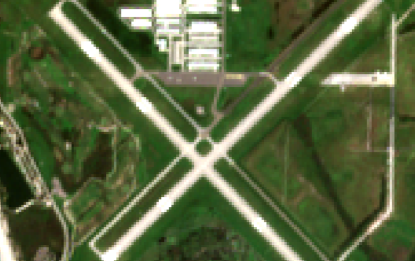
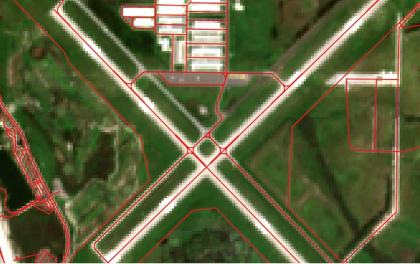
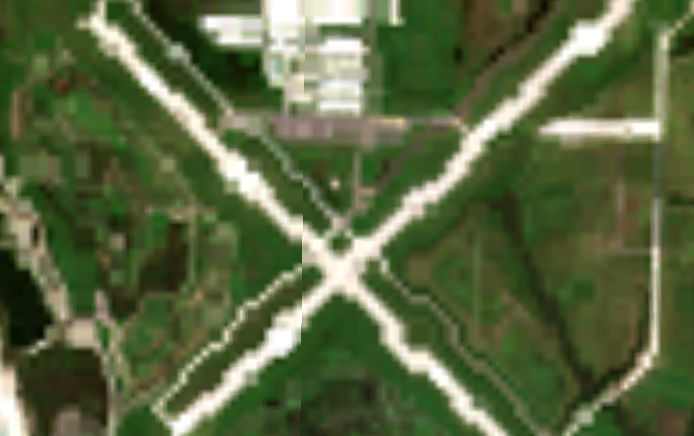
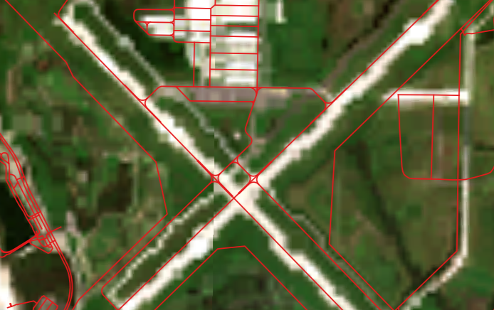
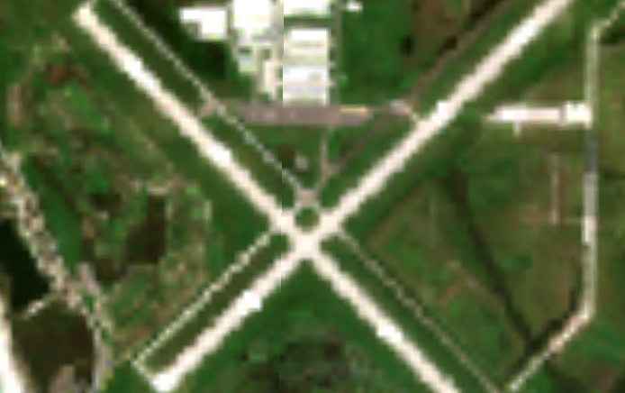
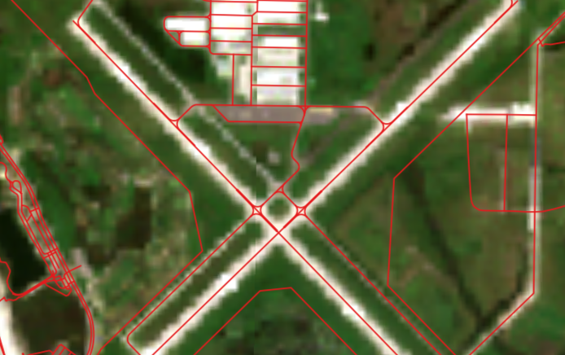

[](https://github.com/duncanmartyn/rasterioxyz/actions/workflows/publish.yaml)
[](https://github.com/duncanmartyn/rasterioxyz/actions/workflows/test.yaml)
[](https://app.codacy.com/gh/duncanmartyn/rasterioxyz/dashboard?utm_source=gh&utm_medium=referral&utm_content=&utm_campaign=Badge_coverage)
[](https://app.codacy.com/gh/duncanmartyn/rasterioxyz/dashboard?utm_source=gh&utm_medium=referral&utm_content=&utm_campaign=Badge_grade)
[](https://github.com/PyCQA/bandit)

- [RasterioXYZ](#rasterioxyz)
- [Introduction](#introduction)
- [Design](#design)
    - [Memory efficiency](#memory-efficiency)
    - [Flexibility](#flexibility)
- [Examples](#examples)
  - [Cloud Storage](#cloud-storage)
- [Benchmarks](#benchmarks)
  - [Source image (EPSG:32617)](#source-image-epsg32617)
  - [QGIS-generated tiles](#qgis-generated-tiles)
  - [RasterioXYZ-generated tiles](#rasterioxyz-generated-tiles)
- [Roadmap](#roadmap)
    - [High](#high)
    - [Medium](#medium)
    - [Low](#low)
- [Testing](#testing)
- [Contributions](#contributions)

# RasterioXYZ
Package for tiling georeferenced Rasterio DatasetReader objects according to the XYZ tiles standard.

# Introduction
RasterioXYZ is a lightweight XYZ tile generator written in and depending on the following:
- `python ^3.10`
- `rasterio ^1.3.9`
- `numpy ^1.26.2`

For greater functionality in navigating the tile-tree, see [`Mercantile`](https://github.com/mapbox/mercantile).

# Design
### Memory efficiency
While reprojecting the entire source image at the maximum resolution required, thereof dictated by the maximum zoom level specified, would result in faster tiling, this represents a considerable potential source of memory issues. Such an approach would preclude the tiling of large images, be they large due to spatial resolution, data type, number of bands, and/or area covered. By lazily reading and, if needed, reprojecting windows of the source dataset at a given tile's resolution, memory use is kept low.

### Flexibility
Some basic design decisions for flexibility:
- Imagery of all data types and PROJ-recognised projections can be tiled with no alterations made to the original dataset
- Tiles need not be generated for all zoom levels in a range
- Tiles can be saved in PNG or JPEG format, though the XYZ standard dictates the former (as well as lossless and seemingly better colour balancing)
- Use of any Rasterio recognised resampling technique
- Creation of standard (256 px) or high (512 px) resolution tiles

# Examples
```
import rasterio
import rasterioxyz

img = rasterio.open("georeferenced_image.tif")
tiled = rasterioxyz.Tiles(image=img, zooms=range(10), pixels=512, resampling="bilinear")
tiled.write("out_directory")
```
Several measurements can be taken to improve the speed of tiling:
- Employ source imagery already projected in EPSG:3857
- Specify a maximum zoom level at which tile spatial resolution does not greatly exceed that of the source imagery
- Use the default tile dimensions of 256 pixels
- Use the default nearest-neighbour resampling

Tiles saved locally can be served to desktop GIS platforms. This is useful in testing and evaluating results prior to incurring costs of cloud storage read and write operations.
The following demonstrates this with **Command Prompt** and **QGIS** on **Windows**:
1. In a Command Prompt window, change directory to that of the tiles. Alternatively, instantiate Command Prompt directly from the directory in File Explorer with CTRL + L, enter "cmd", then press Enter.
   - The `http` and `socketserver` modules of the standard library may also be used to create an HTTP server with greater control over features like caching.
2. In Command Prompt, enter `python -m http.server [port]`, where `[port]` is an unused TCP port (e.g., 8080).
3. Add the connection in QGIS via the **Data Source Manager** or **Browser Panel**:
   - **URL** should be set to the connection string, formatted as follows: `http://localhost:8888/[directory]/{z}/{x}/{y}.[extension]`, where `[directory]` is the path to the folder within which zoom level folders, column folders, and tile images reside and `[extension]` is the format of tile images.
   - **Min. Zoom Level** should be set to the minimum zoom level of the generated tiles.
   - **Max. Zoom Level** should be set to the maximum zoom level of the generated tiles.
   - **Tile Resolution** should be set to the resolution of the generated tiles, denoted by the `Tiles` class' `pixels` parameter.
4. The XYZ layer should now be available for addition to the Layers Panel and navigable within the map canvas.
   - Once added, assuming the connection is OK, the Command Prompt window will display the tiles requested by QGIS as the map is navigated.

## Cloud Storage
Generated tiles can be written to cloud storage services like Azure Blob Storage and Amazon S3.
Once relevant functionality has been added, an example will be shown here.
For now, the generated data can be written to cloud storage using the relevant SDK.

# Benchmarks
Times are measured in seconds for a single 100 KM by 100 KM, 10m resolution, uint8 Sentinel-2 scene. The image was tiled up to and including zoom level 13 (the zoom level before which 256 pixel tiles of the source image require source resolution upscaling), producing 983 tiles. Tiles were written in PNG format by both applications.

| Method      | Threads | Source image CRS | Tile dimensions (px) | Zooms 0-13 time (s) |
| ----------- | :-----: | :--------------: | :------------------: | :-----------------: |
| rasterioxyz | 1       | EPSG:32617       | 256                  | 31.79               |
| rasterioxyz | 1       | EPSG:32617       | 512                  | 81.33               |
| rasterioxyz | 1       | EPSG: 3857       | 256                  | 17.01               |
| rasterioxyz | 1       | EPSG: 3857       | 512                  | 32.01               |
| QGIS        | 16      | EPSG:32617       | 256                  | 4.13                |
| QGIS        | 16      | EPSG:32617       | 512                  | 9.37                |
| QGIS        | 16      | EPSG:3857        | 256                  | 2.06                |
| QGIS        | 16      | EPSG:3857        | 512                  | 4.96                |

Clearly, QGIS is - at present - many times faster (between 6.6 and 8.7 times). It's likely that some combination of threads, use of lower-level languages, on-the-fly reprojection (in the case of non-3857 images), caching, and pyramids may contribute to QGIS' speed. Potential adoption of threading across bottlenecks (reprojection, writing) is a high priority.

That said, tiles generated by RasterioXYZ appear to exhibit better horizontal accuracy and fewer resampling-derived artefacts than those of QGIS:

## Source image (EPSG:32617)
| Without OSM | With OSM |
| :-: | :-: |
|  |  |

## QGIS-generated tiles
| Without OSM | With OSM |
| :-: | :-: |
|  |  |

## RasterioXYZ-generated tiles
| Without OSM | With OSM |
| :-: | :-: |
|  |  |

# Roadmap
A number of improvements are possible and/or planned. Sorted by priority, these are as follows.

### High
- Better handling of non-uint8 datasets with extreme outlying values
  - For example, uint16 Sentinel-2 imagery with extreme outliers in the form of snow or cloud may result in poorly contrasted tiles
  - Source data does not display as such in QGIS due to percentile minimum/maximum stretching (i.e., 2nd and 98th percentiles are set as the minimum and maximum values)
- In-built support for AWS, Azure, and GCP cloud storage write
  - Ideally via requests to reduce additional dependencies
- Enable user selection of no data value
- Investigate threads for data reprojection and writing
- Reduce the write time of tile images
  - PIL and OpenCV write to file faster but increase dependencies
- Static method to identify maximum zoom level without data upscaling

### Medium
- Tile data within a user-provided area
- Enable user selection of raster bands/channels to tile
- Add command line functionality
- Enable tiling of sequences of Rasterio datasets
- Support for colour ramps/tables with singleband images

### Low
- Resume/continue mode
- Greater support for different argument values/types (e.g., int/float for resampling)
- Generate HTML map of tiled data

# Testing
The test suite for RasterioXYZ uses Rasterio MemoryFile objects containing randomly generated data of specified dtype projected in a specified CRS.

To add additional mock data for testing, do the following in `conftest.py`:
- Add the target CRS integer to `SUPPORTED_TEST_CRS`
- Add the target bounding box in said CRS to `TEST_BOUNDS`
- If desired, change the values for `height`, `width`, and `count` - these are currently hardcoded

Then, in `test_tile.py`:
- Add the appropriate arguments to the `pytest.mark.parameterize()` decorator for the method to test. For example, after adding EPSG:4269 (NAD83) and a corresponding bounding box, the argument for the `test_data` parameter may appear like so: `{"crs": 4269, "dtype": "uint8"}`

# Contributions
Feel free to raise any issues, especially bugs and feature requests!
